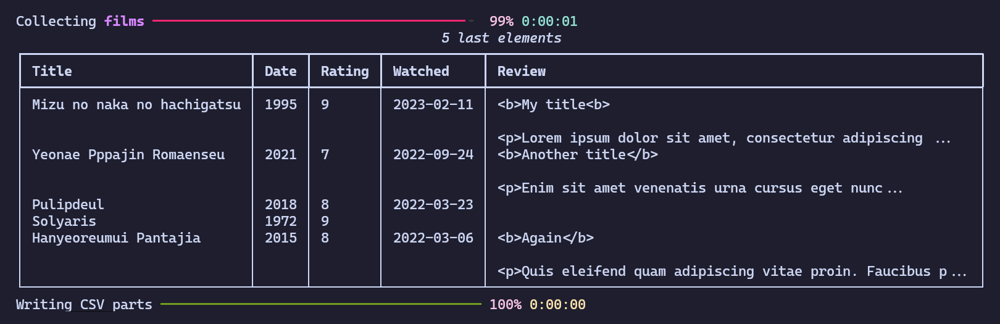

<div align="center">

# SensCritique2Letterboxd (s2l) 🍿📊

A script to export your movies from [SensCritique](https://senscritique.com) to [Letterboxd](https://letterboxd.com).

(It also works for _private_ members!)

Supports: <b>watched</b> items (with <i>ratings</i>, <i>watched date</i>, <i>reviews</i>) and <b>watchlist</b>



</div>

## Installation

### Pip

Install the package with:

```bash
pip install s2l
```

## Usage

| Argument             | Type   | Default         | Description                                                      |
| -------------------- | ------ | --------------- | ---------------------------------------------------------------- |
| `--interactive`/`-i` | `bool` | `False`         | Interactive mode                                                 |
| `--username`         | `str`  | `None`          | Username (unused if interactive mode)                            |
| `--add_tv`           | `bool` | `False`         | **Optional**: Add TV shows (unused if interactive mode)          |
| `--add_reviews`      | `bool` | `False`         | **Optional**: Add reviews (unused if interactive mode)           |
| `--watchlist_only`   | `bool` | `False`         | **Optional**: Export watchlist only (unused if interactive mode) |
| `--user_agent`       | `str`  | `"Mozilla/5.0"` | **Optional**: User agent to use when request                     |

### 🌟 New feature (+0.2.0): interactive mode

```bash
s2l -i
```

### CLI

Please replace every `{USERNAME}` with your username.

#### Watched

To export your movies:

```bash
s2l --username {USERNAME} --output movies.csv
```

If you also want to add your TV shows, please run:

```bash
s2l --username {USERNAME} --output movies.csv --add_tv
```

Finally if you want add your reviews:

```bash
s2l --username {USERNAME} --output movies.csv --add_reviews
```

#### Watchlist

To export the movies you _want_ to watch (named "Watchlist" on Letterboxd):

```bash
s2l --username {USERNAME} --output watchlist.csv --watchlist_only
```

And [import](https://letterboxd.com/import/) your CSV ✨.

## Development

You can spawn a shell with all dependencies with the following method

### uv

```bash
uv venv
```

### Nix

```bash
nix-shell
```
